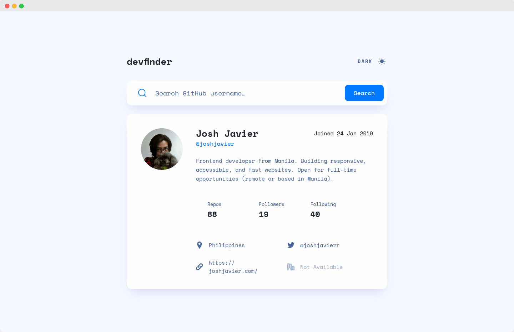

# Frontend Mentor - GitHub user search app solution

This project is a solution to the [GitHub user search app challenge on Frontend Mentor](https://www.frontendmentor.io/challenges/github-user-search-app-Q09YOgaH6). It is also my fourth capstone project for [The Complete 2024 Web Development Bootcamp on Udemy](https://betmgm.udemy.com/course/the-complete-web-development-bootcamp/).

[**View App »**](https://devfinder.fly.dev/)

## Table of contents

- [Overview](#overview)
  - [Project requirements](#project-requirements)
  - [Links](#links)
- [My process](#my-process)
  - [Built with](#built-with)
  - [Development](#development)
  - [Deployment](#deployment)
  - [Useful resources](#useful-resources)
- [Author](#author)
<!-- - [Acknowledgments](#acknowledgments) -->

## Overview



### Project requirements

**Frontend Mentor - GitHub user search app**

Users should be able to:

- [x] View the optimal layout for the app depending on their device's screen size
- [x] See hover states for all interactive elements on the page
- [x] Search for GitHub users by their username
- [x] See relevant user information based on their search
- [x] Switch between light and dark themes
- [x] **Bonus**: Have the correct color scheme chosen for them based on their computer preferences. _Hint_: Research `prefers-color-scheme` in CSS.

**Capstone Project - Use a Public API**

- [x] Integrate a public API from the [provided list](https://github.com/appbrewery/public-api-lists)
- [x] Set up a Node.js project using Express.js
- [x] Use Axios for making HTTP requests
- [x] Use EJS for templating
- [x] Present the retrieved data in a user-friendly way
- [x] Handle errors gracefully (e.g., user not found)
- [x] Write documentation and comments to explain your logic

### Links

- Frontend Mentor Solution URL: https://www.frontendmentor.io/solutions/github-user-search-app-using-expressjs-and-axios-feat-lightning-css-5HNSFQwoW_
- Live Site URL: https://devfinder.fly.dev

## My process

### Built with

- [Express.js](https://expressjs.com/) - web app framework
- [Axios](https://axios-http.com/) - Promise-based HTTP client
- [EJS](https://ejs.co/) - templating language
- [Lightning CSS](https://lightningcss.dev/) - CSS processor
- [GitHub users API](https://docs.github.com/en/rest/users/users?apiVersion=2022-11-28#get-a-user) - The Data Source

### Development

Since I'm using a build step for the CSS, I open two terminals when developing: one for the Express server and another to automatically rerun the CSS build step when a CSS file is changed.

```sh
# Run the Express server
npx nodemon index.js

# Rebundle CSS files to public/style.css when file changes are detected (run this in another terminal)
npm run dev
```

To enable live reload during development, add these inside the `<head>` tag:

```html
<!-- Only load in development -->
<script defer src="https://livejs.com/live.js"></script>
```

**Make sure to remove/comment out the live reload script above before building for production!**

### Deployment

Since this app serves server-rendered HTML, I'm using Fly.io for deployments.

Here are the steps for making your own deployment (make sure your machine has `flyctl` installed):

1. Launch a new Fly app but don't deploy yet:

```sh
fly launch --no-deploy
```

2. Update the Dockerfile and make sure these lines are under `COPY . .`:

```dockerfile
# Build application
RUN npm run build

# Remove development dependencies
RUN npm prune --omit=dev
```

3. (Optional) Adjust the `NODE_VERSION` in the Dockerfile

```dockerfile
ARG NODE_VERSION=lts-bookworm
```

4. Deploy the app.

```sh
fly deploy
# Or, if you're getting stuck on "Waiting for depot builder":
# fly deploy --depot=false
```

<!-- ### What I learned

Use this section to recap over some of your major learnings while working through this project. Writing these out and providing code samples of areas you want to highlight is a great way to reinforce your own knowledge.

To see how you can add code snippets, see below:

```html
<h1>Some HTML code I'm proud of</h1>
```
```css
.proud-of-this-css {
  color: papayawhip;
}
```
```js
const proudOfThisFunc = () => {
  console.log('🎉')
}
```

If you want more help with writing markdown, we'd recommend checking out [The Markdown Guide](https://www.markdownguide.org/) to learn more.

**Note: Delete this note and the content within this section and replace with your own learnings.** -->

<!-- ### Continued development

Use this section to outline areas that you want to continue focusing on in future projects. These could be concepts you're still not completely comfortable with or techniques you found useful that you want to refine and perfect.

**Note: Delete this note and the content within this section and replace with your own plans for continued development.** -->

### Useful resources

- [Building a theme switch component](https://web.dev/articles/building/a-theme-switch-component)
- [Fine, I’ll Use a Super Basic CSS Processing Setup.](https://frontendmasters.com/blog/fine-ill-use-a-super-basic-css-processing-setup/) - This is where I got the idea of using Turbowatch and Live.js to make developing with Lightning CSS a little more productive.
- [Using EJS with Express](https://github.com/mde/ejs/wiki/Using-EJS-with-Express)
- [Advice on a design pattern for api fetch (async) in a constructor](https://www.reddit.com/r/learnjavascript/comments/tw2yvv/advice_on_a_design_pattern_for_api_fetch_async_in/) - A Reddit thread where I stumbled upon the idea of [making an async factory function](https://www.reddit.com/r/learnjavascript/comments/tw2yvv/comment/i3ctjtq/), which I used to implement data fetching in the backend.

## Author

- Website - [Josh Javier](https://joshjavier.com)
- Frontend Mentor - [@joshjavier](https://www.frontendmentor.io/profile/joshjavier)
- Twitter - [@joshjavierr](https://www.twitter.com/joshjavierr)
- LinkedIn - [Josh Javier](https://www.linkedin.com/in/joshjavier)

<!-- ## Acknowledgments

This is where you can give a hat tip to anyone who helped you out on this project. Perhaps you worked in a team or got some inspiration from someone else's solution. This is the perfect place to give them some credit.

**Note: Delete this note and edit this section's content as necessary. If you completed this challenge by yourself, feel free to delete this section entirely.** -->
